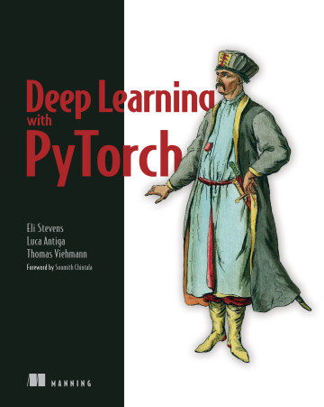

# Introduction to Pytorch / *Deep Learning with Pytorch*

This repository contains pytorch tutorials and practice files from the book
**Deep Learning with Python** by *by Eli Stevens, Luca Antiga, and Thomas Viehmann, published by Manning Publications*.



The Manning site for the book is: https://www.manning.com/books/deep-learning-with-pytorch.
Link to original git repo: https://github.com/deep-learning-with-pytorch/dlwpt-code.


## Contents in the Repository
1. [About Deep Learning with Pytorch](#1-about-deep-learning-with-pytorch)
2. [Requirements](#1-requirements)
3. [Installation](#2-installation)


## 1. About Deep Learning with Pytorch
This book has the aim of providing the foundations of deep learning with PyTorch and showing them in action in a 
real-life project. This book, tries to provide intuition that will support further exploration, and in doing so 
it selectively delve into details to show what is going on behind the curtain. The most notable absence is 
recurrent neural networks, but the same is true for other parts of the PyTorch API.

## 2. Requirements

* python 3.7.6
* Jupyter Notebook
* cuda 10.1
* cudnn 7.6.5

  ```
   # to check cudnn version on windows
   Go to C:\Program Files\NVIDIA GPU Computing Toolkit\CUDA\v8.0\include\
   open cudnn.h
   define CUDNN_MAJOR 7
   define CUDNN_MINOR 6
   define CUDNN_PATCHLEVEL 5
   in my case its 7.6.5
  ```

* torch 1.7.1


## 3. Installation 

1. Install CUDA 10.1 and CUDNN 7.6.5
   
2. Install Jupyter Notebook:
   
   follow procedures as mentioned in: [here](https://jupyterlab.readthedocs.io/en/stable/getting_started/installation.html)

3. Create python virtual environment with Anaconda prompt.

   ```bash
   conda create --name pytorch
   conda activate pytorch
   ```
   
4. Install **Pytorch** library for CUDA 10.1
   
   ```
   pip install torch==1.7.1+cu101 torchvision==0.8.2+cu101 torchaudio==0.7.2 -f https://download.pytorch.org/whl/torch_stable.html
   ```
   
5. AddPython environment to jupyter notebook:
   
   follow procedures as mentioned in: [here](https://janakiev.com/blog/jupyter-virtual-envs/)
   
   ```bash
   pip install --user ipykernel
   python -m ipykernel install --user --name=pytorch
   ```

This should print the following:

Installed kernelspec myenv in /home/user/.local/share/jupyter/kernels/pytorch

